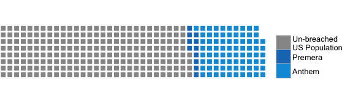
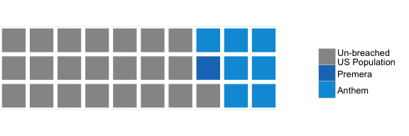
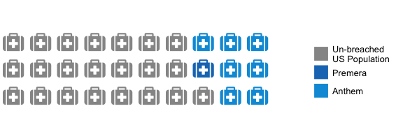
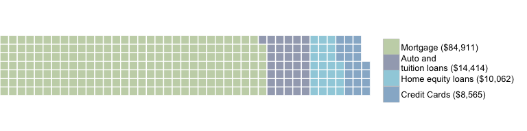
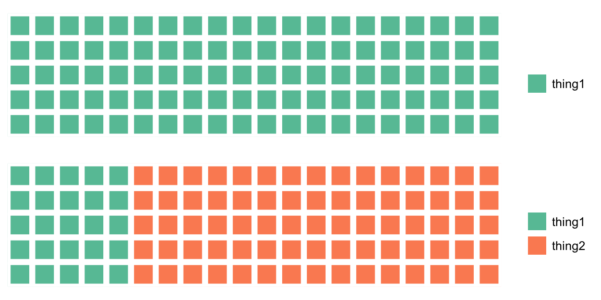
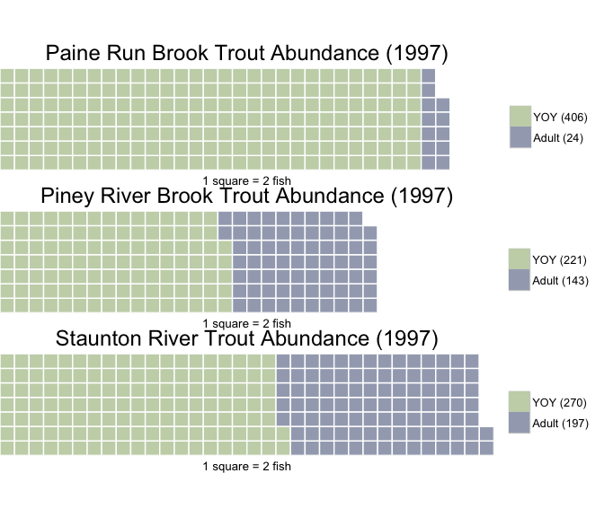

[](https://travis-ci.org/hrbrmstr/waffle) [](https://cran.r-project.org/package=waffle) 

`waffle` is a package to make waffle charts (square pie charts)

It uses ggplot2 and returns a ggplot2 object.

The following functions are implemented:

-   `waffle` : make a waffle chart ggplot2 object
-   `iron` : vertically stitch together multiple waffle plots, left-aligning edges (best if used with the `waffle` `pad` parameter)

### Installation

``` r
install.packages("waffle")
```

### Usage

``` r
library(waffle)

# current verison
packageVersion("waffle")
## [1] '0.7.0'

# basic example
parts <- c(80, 30, 20, 10)
```

``` r
waffle(parts, rows=8)
```


``` r
# slightly more complex example
parts <- c(`Un-breached\nUS Population`=(318-11-79), `Premera`=11, `Anthem`=79)
```

``` r
waffle(parts, rows=8, size=1, colors=c("#969696", "#1879bf", "#009bda"), legend_pos="bottom") 
```

**Health records breaches as fraction of US Population** 

<span style="font-size:8pt">One square == 1m ppl</span>

``` r
waffle(parts/10, rows=3, colors=c("#969696", "#1879bf", "#009bda")) 
```

**Health records breaches as fraction of US Population** 

<span style="font-size:8pt">(One square == 10m ppl)</span>

``` r
library(extrafont)
waffle(parts/10, rows=3, colors=c("#969696", "#1879bf", "#009bda"),
       use_glyph="medkit", size=8)
```



``` r
# replicating an old favourite

# http://graphics8.nytimes.com/images/2008/07/20/business/20debtgraphic.jpg
# http://www.nytimes.com/2008/07/20/business/20debt.html
savings <- c(`Mortgage\n($84,911)`=84911, `Auto and\ntuition loans\n($14,414)`=14414, 
             `Home equity loans\n($10,062)`=10062, `Credit Cards\n($8,565)`=8565)
```

``` r
waffle(savings/392, rows=7, size=0.5, legend_pos="bottom",
       colors=c("#c7d4b6", "#a3aabd", "#a0d0de", "#97b5cf"))
```

**Average Household Savings Each Year** 

<span style="font-size:8pt">(1 square == $392)</span>

``` r
# similar to but not exact

# https://eagereyes.org/techniques/square-pie-charts
professional <- c(`Male`=44, `Female (56%)`=56)
```

``` r
waffle(professional, rows=10, size=0.5, colors=c("#af9139", "#544616"))
```

### Keeps factor by default levels now

With:

``` r
iron(
  waffle(c(thing1=0, thing2=100), rows=5),  
  waffle(c(thing1=25, thing2=75), rows=5)
)
```



Without (you can disable this via `keep` parameter now):

``` r
iron(
  waffle(c(thing1=0, thing2=100), rows=5, keep=FALSE),  
  waffle(c(thing1=25, thing2=75), rows=5, keep=FALSE)
)
```


**Professional Workforce Makeup**


Iron example (left-align & padding for multiple plots)

``` r
pain.adult.1997 <- c(`YOY (406)`=406, `Adult (24)`=24)

A <- waffle(pain.adult.1997/2, rows=7, size=0.5, 
            colors=c("#c7d4b6", "#a3aabd"), 
            title="Paine Run Brook Trout Abundance (1997)", 
            xlab="1 square = 2 fish", pad=3)

pine.adult.1997 <- c(`YOY (221)`=221, `Adult (143)`=143)

B <- waffle(pine.adult.1997/2, rows=7, size=0.5, 
            colors=c("#c7d4b6", "#a3aabd"), 
            title="Piney River Brook Trout Abundance (1997)", 
            xlab="1 square = 2 fish", pad=8)

stan.adult.1997 <- c(`YOY (270)`=270, `Adult (197)`=197)

C <- waffle(stan.adult.1997/2, rows=7, size=0.5, 
            colors=c("#c7d4b6", "#a3aabd"), 
            title="Staunton River Trout Abundance (1997)", 
            xlab="1 square = 2 fish")

iron(A, B, C)
```



### Test Results

``` r
library(waffle)
library(testthat)

date()
## [1] "Sat Jan  7 08:05:00 2017"

test_dir("tests/")
## testthat results ========================================================================================================
## OK: 1 SKIPPED: 0 FAILED: 0
## 
## DONE ===================================================================================================================
```
