[](https://travis-ci.org/hrbrmstr/waffle)
[](https://cran.r-project.org/package=waffle)


# waffle

Create Waffle Chart Visualizations

## Description

Square pie charts (a.k.a. waffle charts) can be used to communicate
parts of a whole for categorical quantities. To emulate the percentage
view of a pie chart, a 10x10 grid should be used with each square
representing 1% of the total. Modern uses of waffle charts do not
necessarily adhere to this rule and can be created with a grid of any
rectangular shape. Best practices suggest keeping the number of
categories small, just as should be done when creating pie charts. Tools
are provided to create waffle charts as well as stitch them together,
and to use glyphs for making isotype pictograms.

It uses ggplot2 and returns a ggplot2 object.

## NOTE

The `master` branch is the stable branch of `waffle`.

The current in-development branch is
[`1.0.0`](https://github.com/hrbrmstr/waffle/tree/1.0.0) if you want to
play with bleeding edge features (like the new waffle geom).

## What’s Inside The Tin?

The following functions are implemented:

  - `waffle` : make a waffle chart ggplot2 object
  - `iron` : vertically stitch together multiple waffle plots,
    left-aligning edges (best if used with the `waffle` `pad` parameter)
  - `fa_grep`: Search FontAwesome names for a pattern
  - `fa_list`: List all FontAwesome names
  - `geom_waffle`/`stat_waffle`: Waffle geoms\! (WIP)

## Installation

``` r
install.packages("waffle")
```

## Usage

``` r
library(waffle)

# current verison
packageVersion("waffle")
## [1] '0.9.2'
```

### Geoms\! (WIP)

``` r
library(hrbrthemes)
library(waffle)
library(tidyverse)

tibble(
  parts = factor(rep(month.abb[1:3], 3), levels=month.abb[1:3]),
  values = c(10, 20, 30, 6, 14, 40, 30, 20, 10),
  fct = c(rep("Thing 1", 3), rep("Thing 2", 3), rep("Thing 3", 3))
) -> xdf

ggplot(xdf, aes(fill=parts, values=values)) +
  geom_waffle(color = "white", size=1.125, n_rows = 6) +
  facet_wrap(~fct, ncol=1) +
  scale_x_discrete(expand=c(0,0)) +
  scale_y_discrete(expand=c(0,0)) +
  ggthemes::scale_fill_tableau(name=NULL) +
  coord_equal() +
  labs(
    title = "Faceted Waffle Geoms"
  ) +
  theme_ipsum_rc(grid="") +
  theme_enhance_waffle()
```

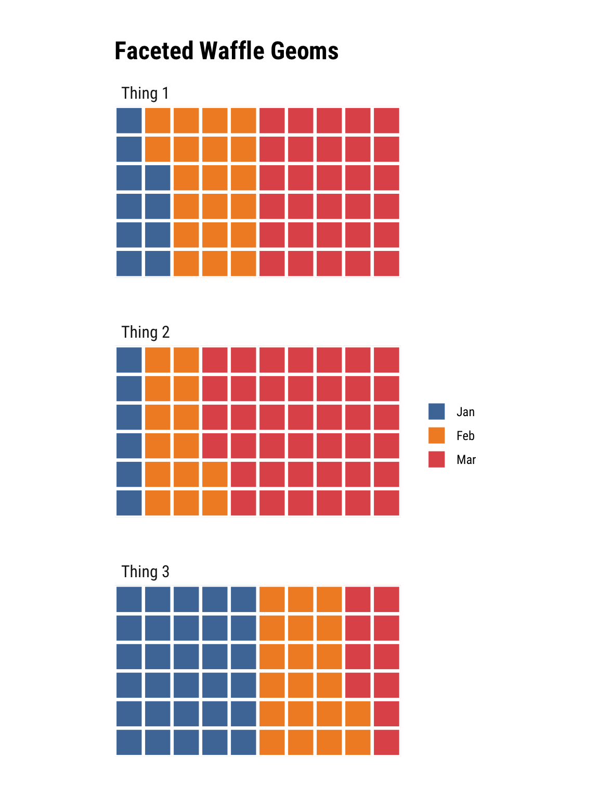

### Waffle Bar Charts with scales\!

``` r
library(dplyr)
library(waffle)
storms %>% 
  filter(year >= 2010) %>% 
  count(year, status) -> storms_df
ggplot(storms_df, aes(fill = status, values = n)) + 
  geom_waffle(color = "white", size = .25, n_rows = 10, flip = TRUE) +
  facet_wrap(~year, nrow = 1, strip.position = "bottom") +
  scale_x_discrete() + 
  scale_y_continuous(labels = function(x) x * 10, # make this multiplyer the same as n_rows
                     expand = c(0,0)) +
  ggthemes::scale_fill_tableau(name=NULL) +
  coord_equal() +
  labs(
    title = "Faceted Waffle Bar Chart",
    subtitle = "{dplyr} storms data",
    x = "Year",
    y = "Count"
  ) +
  theme_minimal(base_family = "Roboto Condensed") +
  theme(panel.grid = element_blank(), axis.ticks.y = element_line()) +
  guides(fill = guide_legend(reverse = TRUE))
```

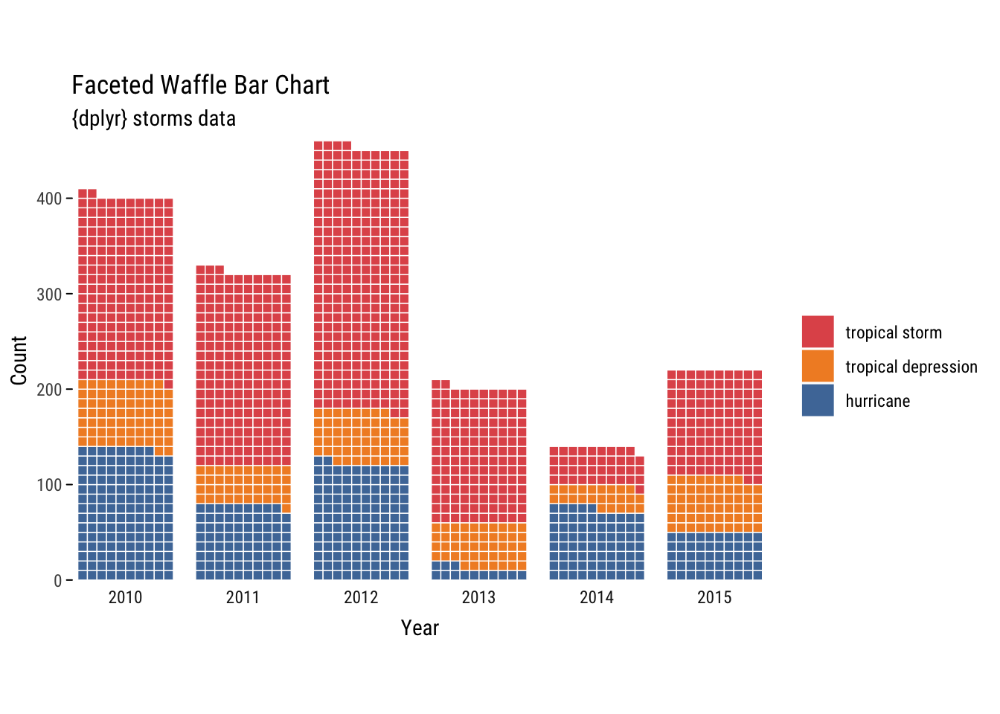

### Basic example

``` r
parts <- c(80, 30, 20, 10)
waffle(parts, rows = 8)
```

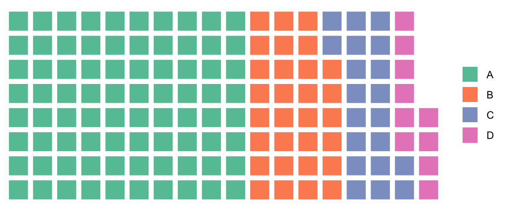

### Use a data frame

``` r
parts <- data.frame(
  names = LETTERS[1:4],
  vals = c(80, 30, 20, 10)
)

waffle(parts, rows = 8)
```


### Slightly more complex example

``` r
parts <- c(`Un-breached\nUS Population` = (318 - 11 - 79), `Premera` = 11, `Anthem` = 79)
```

``` r
waffle(
  parts, rows = 8, size = 1, 
  colors = c("#969696", "#1879bf", "#009bda"), legend_pos = "bottom"
)
```

**Health records breaches as fraction of US Population**
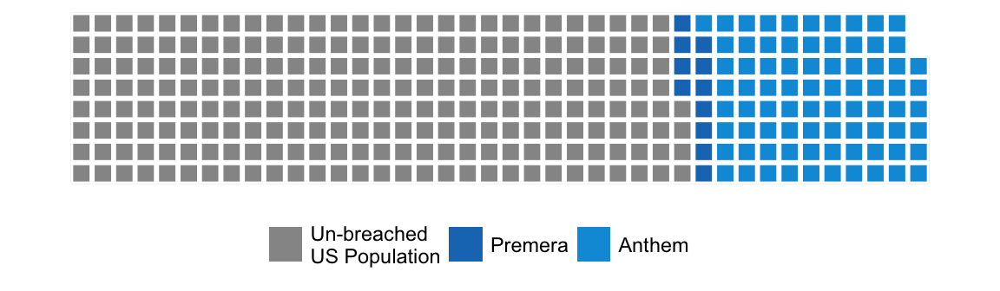

<span style="font-size:8pt">One square == 1m ppl</span>

``` r
waffle(
  parts / 10, rows = 3,
  colors = c("#969696", "#1879bf", "#009bda")
)
```

**Health records breaches as fraction of US Population**
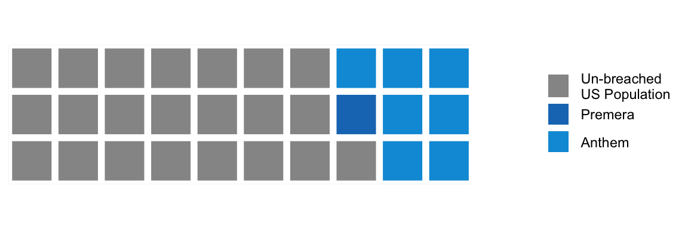

<span style="font-size:8pt">(One square == 10m ppl)</span>

``` r
library(extrafont)

waffle(
  parts / 10, rows = 3, colors = c("#969696", "#1879bf", "#009bda"),
  use_glyph = "medkit", size = 8
)
```

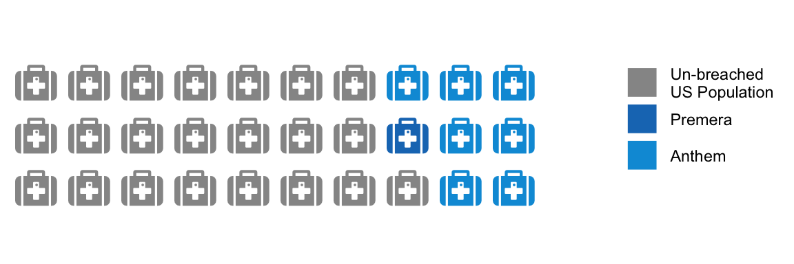

### Replicating an old favourite


Via: <https://www.nytimes.com/2008/07/20/business/20debt.html>

``` r
savings <- c(
  `Mortgage\n($84,911)` = 84911, `Auto and\ntuition loans\n($14,414)` = 14414,
  `Home equity loans\n($10,062)` = 10062, `Credit Cards\n($8,565)` = 8565
)
```

``` r
waffle(
  savings / 392, rows = 7, size = 0.5, legend_pos = "bottom",
  colors = c("#c7d4b6", "#a3aabd", "#a0d0de", "#97b5cf")
)
```

**Average Household Debt**
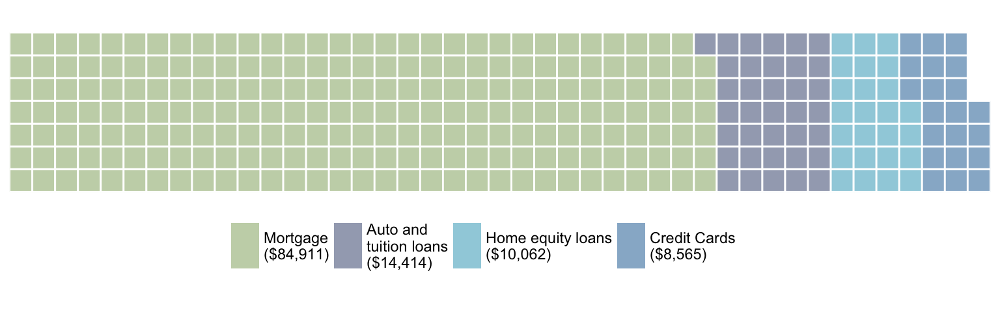

<span style="font-size:8pt">(1 square == $392)</span>

### More replication

Similar to <https://eagereyes.org/techniques/square-pie-charts>

``` r
professional <- c(`Male` = 44, `Female (56%)` = 56)
```

``` r
waffle(
  professional, rows = 10, size = 0.5,
  colors = c("#af9139", "#544616")
)
```

### Keeps factor by default levels now

With:

``` r
iron(
  waffle(c(thing1 = 0, thing2 = 100), rows = 5),
  waffle(c(thing1 = 25, thing2 = 75), rows = 5)
)
```

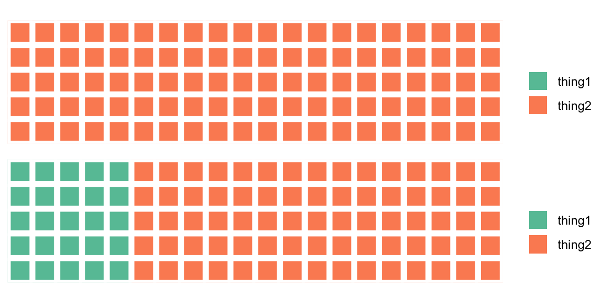

Without (you can disable this via `keep` parameter now):

``` r
iron(
  waffle(c(thing1 = 0, thing2 = 100), rows = 5, keep = FALSE),
  waffle(c(thing1 = 25, thing2 = 75), rows = 5, keep = FALSE)
)
```

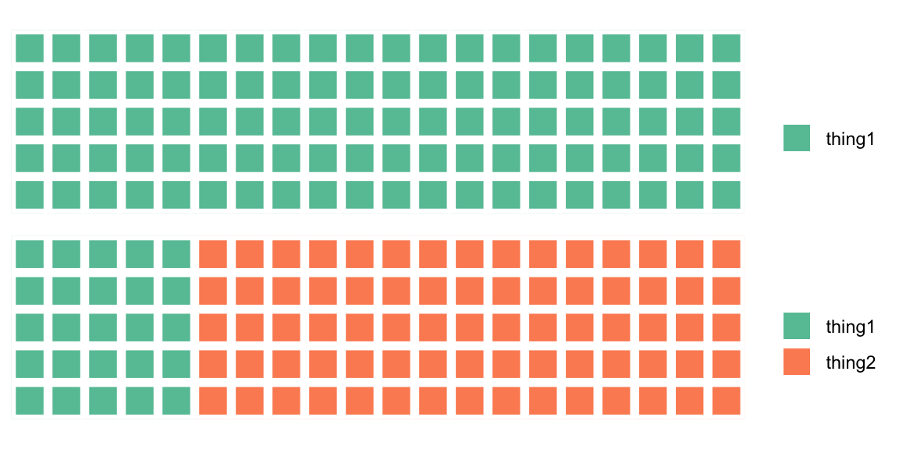

**Professional Workforce Makeup**

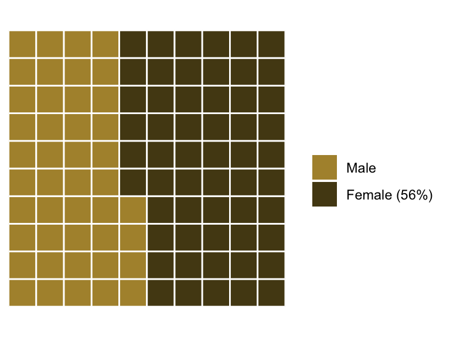

Iron example (left-align & padding for multiple plots)

``` r
pain.adult.1997 <- c(`YOY (406)` = 406, `Adult (24)` = 24)

waffle(
  pain.adult.1997 / 2, rows = 7, size = 0.5,
  colors = c("#c7d4b6", "#a3aabd"),
  title = "Paine Run Brook Trout Abundance (1997)",
  xlab = "1 square = 2 fish", pad = 3
) -> A

pine.adult.1997 <- c(`YOY (221)` = 221, `Adult (143)` = 143)

waffle(
  pine.adult.1997 / 2, rows = 7, size = 0.5,
  colors = c("#c7d4b6", "#a3aabd"),
  title = "Piney River Brook Trout Abundance (1997)",
  xlab = "1 square = 2 fish", pad = 8
) -> B

stan.adult.1997 <- c(`YOY (270)` = 270, `Adult (197)` = 197)

waffle(
  stan.adult.1997 / 2, rows = 7, size = 0.5,
  colors = c("#c7d4b6", "#a3aabd"),
  title = "Staunton River Trout Abundance (1997)",
  xlab = "1 square = 2 fish"
) -> C

iron(A, B, C)
```

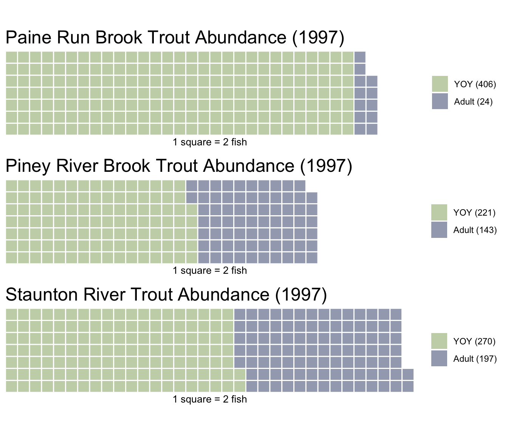

## Code of Conduct

Please note that this project is released with a [Contributor Code of
Conduct](CONDUCT.md). By participating in this project you agree to
abide by its terms.
